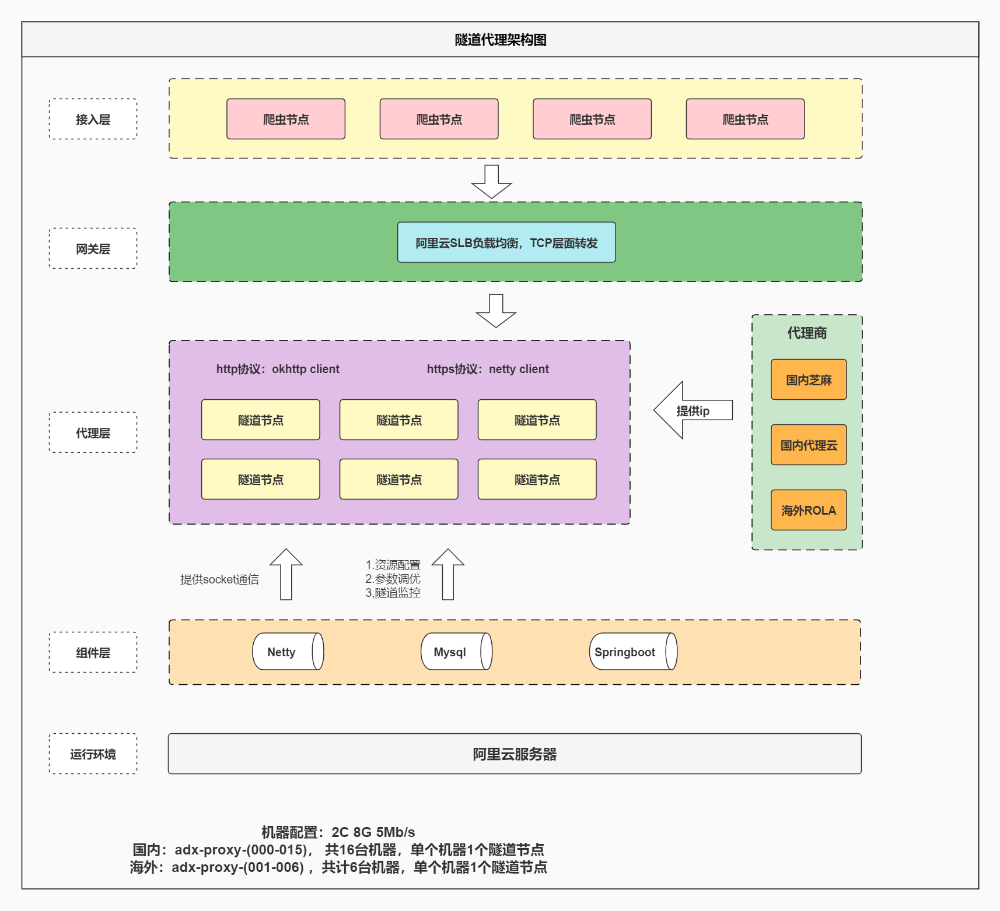

# 工程简介
IP隧道服务，用于爬虫服务的代理IP的管理分配，优质ip筛选，并提供高效安全稳定的http代理服务，助力爬虫高效稳定的爬取数据。


# 背景
爬虫服务会经常使用不同的代理IP去爬取数据。但是随着够买的第三方代理ip越来越多，很多代理ip负载不均衡，且没有监控手段查看ip负载情况，并且有点难以管理，所以需要构建一个IP隧道服务，进而实现代理ip的统一管理，和动态分配。统一转发爬虫的http请求。


# 核心流程
该隧道服务需要把公司内部的服务请求（connect请求），通过这个隧道服务转发出去，把请求的请求行，请求头，请求体按照原封不动的形式，传输给第三方代理的ip，port，代理服务商就会帮我们去直接获取目标地址的资源，然后返回给隧道服务，最后再响应数据给公司的内部服务
> 注意:
遇到的所有请求肯定都是connect代理请求，这些connect请求本身肯定有proxy认证信息，有访问的目标域名，端口，header信息。
不能直接转发这个请求给第三方代理商，需要重新构造一个代理请求发送给代理商。因为认证信息不一样。


# 功能需求

## 负载均衡

1.首先需要部署多个服务实例，每个实例就是一条隧道，将隧道服务做成分布式的，当大量的请求过来后，我们可以借用nginx的负载均衡（或者LVS做TCP层面的负载均衡），将这些请求均匀地路由分配到不同的服务实例上。


## 单进程多隧道
在proxy-server前面加一层springboot(ps：自带web容器)进行管理, 包括创建以下管理信息：
- 需要创建多少个proxy-server实例（对应就是多少条隧道）

- 每个实例的名称，ip，端口，部署的机器位置，需要cpu的核数，内存的总量，网络带宽的总量

- 每个实例需要创建多少boss线程数，worker线程数，连接时的用户名密码，缓存的代理ip总数，每个ip的有效时间，定时任务更新IP池的cron表达式

  

## 隧道初始化
1.初始化建立隧道的时候，需要根据mysql的配置信息进行创建，但是创建出来的所有隧道服务实例消耗的总带宽，不能超过机器带宽的80%，剩下的做备用。
2.根据mysql隧道实例配置列表，创建一个proxy server，监听一个独立的端口
3.隧道动态分配: 后续考虑使用 xxl-job做任务调度，实现根据下发的创建任务进行一个新的隧道的创建

> 注意：1.隧道实例的个数不能随意增加，减少，因为运维分配的端口只有10个(21330-21339)  2.目前也暂不支持隧道的动态创建（根据下发的创建任务进行new一个新的隧道）


## 业务线程安全机制

1.原则上，每条隧道会有一个初始化的线程池，所有的业务请求都会放入队列中，考虑到请求的时效性，每个线程一般处理3个代理请求任务，一定不能让队列有任务积压。那么1000个并发请求，需要设置核心线程数约为350，最大线程数500。业务线程在处理每一个代理请求的时候，需要对慢请求做超时处理（规定3秒钟为超时），放入到一个超时任务队列中（具有优先级的那种），并用单独的线程进行重试，重试3次无果，即返回超时等待的结果。

**超时时间：**

**超时参数配置**。需要根据每个服务的需求，做动态配置，因为有一些视频传输的特殊场景。

**慢请求线程处理。**比方说有500个线程，其中有10%数量的线程，都在处理慢请求。如果这些慢请求的线程超过10%的比例，需要主动中断处理慢请求的线程。防止后续的请求任务积压在队列中，影响其他请求。

**超时时间的设置。**后端重试次数乘以后端的超时时间，不能超过前端总的超时时间。


## ip池更新机制
- [ ] 一般来说，默认会5 min 拉取一次IP，注入到ip池中, ip池的数量会根据mysql配置参数来决定，默认10个（动态配置）。
- [x] 当ip池的数量过低，低于了30%，需要提前触发ip的拉取，不受时间间隔限制。
- [x] 当ip池的数量过高（每个隧道对应ip池的ip个数不能超过10个），需要取消ip的拉取。

**补充：**

**为了服务稳定，ip池的数量，必须全满，不能是动态变化的。**

**ip池的数量x(24hx60min/ip存活时间（分钟）)，小于代理商的每天的IP数量限制。 所以 IP总消耗量不能超过代理商每天分配的数量**

```
// ip_pool_num*((24h*60)/ip_ttl) < ip_total
// 现在暂时不用考虑这个问题，因为ZhiMaService的拉取速率不会超过每天的数量限制。
```


## ip自动检测
- [x] ip利用率的检测：每个ip的使用率需要做统计，在从IP池提取ip去处理请求的时候，需要对ip的引用次数做记录，防止大量请求只打到某几个ip上，导致其他ip没有使用，或使用率很低。
- [x] ip质量检测：每个IP都有一个失效时间，为了提高ip的利用率，我们需要设置一个ip监控线程，在ip失效的前5s检查出来，并进行剔除。某个ip在首次使用后，会超时或失败，需要重试，重试3次过后都不行，会记录失败次数，导致成功率很低。这时就需要通过ip打分机制，将这个ip的权重降低，同时使用率也需要减少。然后会生成一个ip质量有序列表，最后由ip池监控线程将列表末尾的20%剔除掉。（**ps: 需要根据实际执行的日志分析得出结果，再决定如何剔除，因为可能会出现一种极端情况，大量的ip都是低质量的ip，如果全部剔除就会影响服务**）
- [ ] ip打分机制：可以参考elasticsearch的权重打分机制。


## 流量控制
- [x] 需要对每个隧道的并发量做控制，都在1000左右。具体的请求数量限制，由服务器带宽，ip池数量，业务线程可用数量，综合决定，做一个动态的控制。(**ps: 每个隧道的并发量的控制，现在暂时设成固定的1000或者500**)
- [x] 所有的隧道消耗的带宽，加起来不能超过机器总带宽的80%。每条隧道初始化10MB（**ps：暂时不用考虑，因为部署的服务所在的机器，都是一些千兆网卡，公司内部服务的所有请求过来，基本上也不会超过其设定的值。**）


## 日志记录

日志需要清晰的记录转发过程：来源ip，来源请求类型，使用的哪个隧道服务，使用的哪个代理ip，请求的响应结果如何，请求耗时多长，请求超时或错误的具体原因信息。


# 服务部署

```shell
机器地址：61-> adx-crawl-007   10.9.8.1   16/32G
部署路径：/usr/local/htdocs/tunnel-proxy
日志路径：/data0/logs/tunnel-proxy
启动参数：-Dspring.profiles.active=product -Dserver.port=21330
端口使用：21330~21339   #这10个端口是规划给 tunnel-proxy 这个服务的
# 1.根据MySQL初始化不同的隧道列表，每条隧道对应都有一个代理ip环形队列作为ip池（注意：芝麻代理的每个ip获取都是根据你的本机器的ip来计算的，不同的机器ip请求获取的时候，代理IP的可用个数会对应减1，相同的ip获取的时候，只会当作一个）
```


# 架构设计




# 测试

## AB测试

ab -n 1000 -c 1 http://13.209.21.196:8080/trade-server/test/order/testQueue

## 隧道测试

- 本地测试

```
// 测试参数：https://www.baidu.com 每个线程2个任务
并发：200, 成功=343, 失败=57, 失败率=14.25%, 错误原因列表：{SSL peer shut down incorrectly=4, Read timed out=3, timeout=50}
并发：300, 成功=473, 失败=127, 失败率=21.17%, 错误原因列表：{SSL peer shut down incorrectly=10, Read timed out=5, timeout=101}

// 优量广告测试地址：https://mi.gdt.qq.com/gdt_mview.fcg?posid=5000155655915649& 每个线程2个任务
并发：200, 成功=400, 失败=0, 失败率=0%, 错误原因列表：{}
并发：300, 成功=600, 失败=0, 失败率=0%, 错误原因列表：{}
并发：400, 成功=800, 失败=0, 失败率=0%, 错误原因列表：{}
并发：500, 成功=999, 失败=1, 失败率=0.1%, 错误原因列表：{Read timed out=1}
并发：600, 成功=1197, 失败=3, 失败率=0.25%, 错误原因列表：{Read timed out=2, timeout=1}
并发：700, 成功=789, 失败=611, 失败率=43.64%, 错误原因列表：{Read timed out=393, timeout=204}
```

- 线上测试

```
并发：300, 成功=480, 失败=120, 失败率=20%, 错误原因列表：{Read timed out=41, unexpected end of stream on https://mi.gdt.qq.com/...=30, timeout=49}
并发：400, 成功=280, 失败=120, 失败率=30%, 错误原因列表：{Read timed out=100, timeout=20}
并发：500, 成功=350, 失败=100, 失败率=20%, 错误原因列表：{Read timed out=57, timeout=43}
并发：600, 成功=367, 失败=233, 失败率=38.83%, 错误原因列表：{Read timed out=68, unexpected end of stream on https://mi.gdt.qq.com/...=119, timeout=46}
```


## IP质量测试


> 芝麻独享

```sql
----------------------- 并发数：10 ------------------------
IP=61.191.84.183:4216(2022-09-10 16:38:21), 并发=10, 成功=100, 失败=0, 失败率=0%, 平均响应报文大小=352 kb
IP=61.191.84.183:4216(2022-09-10 16:38:21), 并发=10, 成功=100, 失败=0, 失败率=0%, 平均响应报文大小=352 kb
IP=61.191.84.183:4216(2022-09-10 16:38:21), 并发=10, 成功=100, 失败=0, 失败率=0%, 平均响应报文大小=352 kb
IP=61.191.84.183:4216(2022-09-10 16:38:21), 并发=10, 成功=100, 失败=0, 失败率=0%, 平均响应报文大小=352 kb
IP=61.191.84.183:4216(2022-09-10 16:38:21), 并发=10, 成功=100, 失败=0, 失败率=0%, 平均响应报文大小=352 kb
并发数：10, 耗时：41s
----------------------- 并发数：20 ------------------------
IP=117.57.21.75:4216(2022-09-10 16:38:21), 并发=20, 成功=142, 失败=58, 失败率=29%, 平均响应报文大小=250 kb
IP=117.57.21.75:4216(2022-09-10 16:38:21), 并发=20, 成功=200, 失败=0, 失败率=0%, 平均响应报文大小=352 kb
IP=117.57.21.75:4216(2022-09-10 16:38:21), 并发=20, 成功=200, 失败=0, 失败率=0%, 平均响应报文大小=352 kb
IP=117.57.21.75:4216(2022-09-10 16:38:21), 并发=20, 成功=200, 失败=0, 失败率=0%, 平均响应报文大小=352 kb
IP=117.57.21.75:4216(2022-09-10 16:38:21), 并发=20, 成功=147, 失败=53, 失败率=26.5%, 平均响应报文大小=259 kb
并发数：20, 耗时：84s
----------------------- 并发数：30 ------------------------
IP=220.179.211.123:4216(2022-09-10 16:38:22), 并发=30, 成功=300, 失败=0, 失败率=0%, 平均响应报文大小=352 kb
IP=220.179.211.123:4216(2022-09-10 16:38:22), 并发=30, 成功=300, 失败=0, 失败率=0%, 平均响应报文大小=352 kb
IP=220.179.211.123:4216(2022-09-10 16:38:22), 并发=30, 成功=270, 失败=30, 失败率=10%, 平均响应报文大小=317 kb
IP=220.179.211.123:4216(2022-09-10 16:38:22), 并发=30, 成功=300, 失败=0, 失败率=0%, 平均响应报文大小=352 kb
IP=220.179.211.123:4216(2022-09-10 16:38:22), 并发=30, 成功=213, 失败=87, 失败率=29%, 平均响应报文大小=250 kb
并发数：30, 耗时：115s
----------------------- 并发数：40 ------------------------
IP=114.99.7.128:4216(2022-09-10 16:38:22), 并发=40, 成功=398, 失败=2, 失败率=0.5%, 平均响应报文大小=350 kb
IP=114.99.7.128:4216(2022-09-10 16:38:22), 并发=40, 成功=311, 失败=89, 失败率=22.25%, 平均响应报文大小=274 kb
IP=114.99.7.128:4216(2022-09-10 16:38:22), 并发=40, 成功=400, 失败=0, 失败率=0%, 平均响应报文大小=352 kb
IP=114.99.7.128:4216(2022-09-10 16:38:22), 并发=40, 成功=348, 失败=52, 失败率=13%, 平均响应报文大小=306 kb
IP=114.99.7.128:4216(2022-09-10 16:38:22), 并发=40, 成功=399, 失败=1, 失败率=0.25%, 平均响应报文大小=351 kb
并发数：40, 耗时：148s
----------------------- 并发数：50 ------------------------
IP=114.99.5.252:4216(2022-09-10 16:38:22), 并发=50, 成功=496, 失败=4, 失败率=0.8%, 平均响应报文大小=349 kb
IP=114.99.5.252:4216(2022-09-10 16:38:22), 并发=50, 成功=498, 失败=2, 失败率=0.4%, 平均响应报文大小=351 kb
IP=114.99.5.252:4216(2022-09-10 16:38:22), 并发=50, 成功=365, 失败=135, 失败率=27%, 平均响应报文大小=257 kb
IP=114.99.5.252:4216(2022-09-10 16:38:22), 并发=50, 成功=497, 失败=3, 失败率=0.6%, 平均响应报文大小=350 kb
IP=114.99.5.252:4216(2022-09-10 16:38:22), 并发=50, 成功=368, 失败=132, 失败率=26.4%, 平均响应报文大小=259 kb
并发数：50, 耗时：183s
```


> 代理云独享

```sql
----------------------- 并发数：10 ------------------------
IP=117.91.151.151:57114(2022-08-30 15:27:45), 并发=10, 成功=100, 失败=0, 失败率=0%, 平均响应报文大小=349 kb
IP=117.91.151.151:57114(2022-08-30 15:27:45), 并发=10, 成功=100, 失败=0, 失败率=0%, 平均响应报文大小=349 kb
IP=117.91.151.151:57114(2022-08-30 15:27:45), 并发=10, 成功=100, 失败=0, 失败率=0%, 平均响应报文大小=349 kb
IP=117.91.151.151:57114(2022-08-30 15:27:45), 并发=10, 成功=100, 失败=0, 失败率=0%, 平均响应报文大小=349 kb
IP=117.91.151.151:57114(2022-08-30 15:27:45), 并发=10, 成功=100, 失败=0, 失败率=0%, 平均响应报文大小=349 kb
并发数：10, 耗时：123s
----------------------- 并发数：20 ------------------------
IP=117.57.95.64:57114(2022-08-30 15:31:37), 并发=20, 成功=200, 失败=0, 失败率=0%, 平均响应报文大小=348 kb
IP=117.57.95.64:57114(2022-08-30 15:31:37), 并发=20, 成功=200, 失败=0, 失败率=0%, 平均响应报文大小=348 kb
IP=117.57.95.64:57114(2022-08-30 15:31:37), 并发=20, 成功=200, 失败=0, 失败率=0%, 平均响应报文大小=348 kb
IP=117.57.95.64:57114(2022-08-30 15:31:37), 并发=20, 成功=200, 失败=0, 失败率=0%, 平均响应报文大小=349 kb
IP=117.57.95.64:57114(2022-08-30 15:31:37), 并发=20, 成功=200, 失败=0, 失败率=0%, 平均响应报文大小=349 kb
并发数：20, 耗时：121s
----------------------- 并发数：30 ------------------------
IP=27.153.141.40:57114(2022-08-30 15:33:50), 并发=30, 成功=300, 失败=0, 失败率=0%, 平均响应报文大小=348 kb
IP=27.153.141.40:57114(2022-08-30 15:33:50), 并发=30, 成功=300, 失败=0, 失败率=0%, 平均响应报文大小=349 kb
IP=27.153.141.40:57114(2022-08-30 15:33:50), 并发=30, 成功=300, 失败=0, 失败率=0%, 平均响应报文大小=348 kb
IP=27.153.141.40:57114(2022-08-30 15:33:50), 并发=30, 成功=300, 失败=0, 失败率=0%, 平均响应报文大小=348 kb
IP=27.153.141.40:57114(2022-08-30 15:33:50), 并发=30, 成功=300, 失败=0, 失败率=0%, 平均响应报文大小=348 kb
并发数：30, 耗时：120s
----------------------- 并发数：40 ------------------------
IP=114.239.31.151:57114(2022-08-30 15:36:06), 并发=40, 成功=400, 失败=0, 失败率=0%, 平均响应报文大小=349 kb
IP=114.239.31.151:57114(2022-08-30 15:36:06), 并发=40, 成功=400, 失败=0, 失败率=0%, 平均响应报文大小=349 kb
IP=114.239.31.151:57114(2022-08-30 15:36:06), 并发=40, 成功=400, 失败=0, 失败率=0%, 平均响应报文大小=349 kb
IP=114.239.31.151:57114(2022-08-30 15:36:06), 并发=40, 成功=400, 失败=0, 失败率=0%, 平均响应报文大小=349 kb
IP=114.239.31.151:57114(2022-08-30 15:36:06), 并发=40, 成功=400, 失败=0, 失败率=0%, 平均响应报文大小=348 kb
并发数：40, 耗时：124s
----------------------- 并发数：50 ------------------------
IP=222.189.170.54:57114(2022-08-30 15:38:23), 并发=50, 成功=499, 失败=1, 失败率=0.2%, 平均响应报文大小=348 kb
IP=222.189.170.54:57114(2022-08-30 15:38:23), 并发=50, 成功=500, 失败=0, 失败率=0%, 平均响应报文大小=348 kb
IP=222.189.170.54:57114(2022-08-30 15:38:23), 并发=50, 成功=498, 失败=2, 失败率=0.4%, 平均响应报文大小=347 kb
IP=222.189.170.54:57114(2022-08-30 15:38:23), 并发=50, 成功=499, 失败=1, 失败率=0.2%, 平均响应报文大小=348 kb
IP=222.189.170.54:57114(2022-08-30 15:38:23), 并发=50, 成功=498, 失败=2, 失败率=0.4%, 平均响应报文大小=347 kb
并发数：50, 耗时：189s
```


> 代理云

```sql
----------------------- 并发数：10 ------------------------
IP=182.96.47.138:57114(2022-04-21 13:09:26), 并发=10, 成功=50, 失败=0, 失败率=0%, 平均响应报文大小=345 kb
IP=182.96.47.138:57114(2022-04-21 13:09:26), 并发=10, 成功=50, 失败=0, 失败率=0%, 平均响应报文大小=345 kb
IP=182.96.47.138:57114(2022-04-21 13:09:26), 并发=10, 成功=50, 失败=0, 失败率=0%, 平均响应报文大小=345 kb
IP=182.96.47.138:57114(2022-04-21 13:09:26), 并发=10, 成功=49, 失败=1, 失败率=2%, 平均响应报文大小=338 kb
IP=182.96.47.138:57114(2022-04-21 13:09:26), 并发=10, 成功=50, 失败=0, 失败率=0%, 平均响应报文大小=345 kb
并发数：10, 耗时：38s
----------------------- 并发数：20 ------------------------
IP=113.229.60.153:57114(2022-04-21 13:12:50), 并发=20, 成功=86, 失败=14, 失败率=14%, 平均响应报文大小=297 kb
IP=113.229.60.153:57114(2022-04-21 13:12:50), 并发=20, 成功=84, 失败=16, 失败率=16%, 平均响应报文大小=290 kb
IP=113.229.60.153:57114(2022-04-21 13:12:50), 并发=20, 成功=93, 失败=7, 失败率=7%, 平均响应报文大小=321 kb
IP=113.229.60.153:57114(2022-04-21 13:12:50), 并发=20, 成功=92, 失败=8, 失败率=8%, 平均响应报文大小=317 kb
IP=113.229.60.153:57114(2022-04-21 13:12:50), 并发=20, 成功=97, 失败=3, 失败率=3%, 平均响应报文大小=335 kb
并发数：20, 耗时：196s
----------------------- 并发数：30 ------------------------
IP=110.86.183.26:57114(2022-04-21 13:16:05), 并发=30, 成功=125, 失败=25, 失败率=16.67%, 平均响应报文大小=288 kb
IP=110.86.183.26:57114(2022-04-21 13:16:05), 并发=30, 成功=118, 失败=32, 失败率=21.33%, 平均响应报文大小=271 kb
IP=110.86.183.26:57114(2022-04-21 13:16:05), 并发=30, 成功=110, 失败=40, 失败率=26.67%, 平均响应报文大小=253 kb
IP=110.86.183.26:57114(2022-04-21 13:16:05), 并发=30, 成功=114, 失败=36, 失败率=24%, 平均响应报文大小=262 kb
IP=110.86.183.26:57114(2022-04-21 13:16:05), 并发=30, 成功=114, 失败=36, 失败率=24%, 平均响应报文大小=262 kb
并发数：30, 耗时：177s
----------------------- 并发数：40 ------------------------
IP=121.205.230.170:57114(2022-04-21 13:18:32), 并发=40, 成功=194, 失败=6, 失败率=3%, 平均响应报文大小=335 kb
IP=121.205.230.170:57114(2022-04-21 13:18:32), 并发=40, 成功=98, 失败=102, 失败率=51%, 平均响应报文大小=169 kb
IP=121.205.230.170:57114(2022-04-21 13:18:32), 并发=40, 成功=194, 失败=6, 失败率=3%, 平均响应报文大小=335 kb
IP=121.205.230.170:57114(2022-04-21 13:18:32), 并发=40, 成功=100, 失败=100, 失败率=50%, 平均响应报文大小=172 kb
IP=121.205.230.170:57114(2022-04-21 13:18:32), 并发=40, 成功=0, 失败=200, 失败率=100%, 平均响应报文大小=0 kb
并发数：40, 耗时：59s
```


> 亿牛云

```sql
----------------------- 并发数：10 ------------------------
IP=183.136.232.139:32181(2023-01-01 01:01:01), 并发=10, 成功=55, 失败=45, 失败率=45%, 平均响应报文大小=190 kb
IP=183.136.232.139:32181(2023-01-01 01:01:01), 并发=10, 成功=47, 失败=53, 失败率=53%, 平均响应报文大小=162 kb
IP=183.136.232.139:32181(2023-01-01 01:01:01), 并发=10, 成功=53, 失败=47, 失败率=47%, 平均响应报文大小=183 kb
IP=183.136.232.139:32181(2023-01-01 01:01:01), 并发=10, 成功=50, 失败=50, 失败率=50%, 平均响应报文大小=172 kb
IP=183.136.232.139:32181(2023-01-01 01:01:01), 并发=10, 成功=0, 失败=100, 失败率=100%, 平均响应报文大小=0 kb
并发数：10, 耗时：170s
----------------------- 并发数：20 ------------------------
IP=114.231.46.237:28033(2023-01-01 01:01:01), 并发=20, 成功=90, 失败=110, 失败率=55%, 平均响应报文大小=155 kb
IP=114.231.46.237:28033(2023-01-01 01:01:01), 并发=20, 成功=98, 失败=102, 失败率=51%, 平均响应报文大小=169 kb
IP=114.231.46.237:28033(2023-01-01 01:01:01), 并发=20, 成功=84, 失败=116, 失败率=58%, 平均响应报文大小=145 kb
IP=114.231.46.237:28033(2023-01-01 01:01:01), 并发=20, 成功=94, 失败=106, 失败率=53%, 平均响应报文大小=162 kb
IP=114.231.46.237:28033(2023-01-01 01:01:01), 并发=20, 成功=93, 失败=107, 失败率=53.5%, 平均响应报文大小=160 kb
并发数：20, 耗时：173s
----------------------- 并发数：30 ------------------------
IP=114.230.107.180:21651(2023-01-01 01:01:01), 并发=30, 成功=300, 失败=0, 失败率=0%, 平均响应报文大小=345 kb
IP=114.230.107.180:21651(2023-01-01 01:01:01), 并发=30, 成功=300, 失败=0, 失败率=0%, 平均响应报文大小=345 kb
IP=114.230.107.180:21651(2023-01-01 01:01:01), 并发=30, 成功=295, 失败=5, 失败率=1.67%, 平均响应报文大小=339 kb
IP=114.230.107.180:21651(2023-01-01 01:01:01), 并发=30, 成功=296, 失败=4, 失败率=1.33%, 平均响应报文大小=340 kb
IP=114.230.107.180:21651(2023-01-01 01:01:01), 并发=30, 成功=300, 失败=0, 失败率=0%, 平均响应报文大小=345 kb
并发数：30, 耗时：227s
----------------------- 并发数：40 ------------------------
IP=222.189.19.2:34116(2023-01-01 01:01:01), 并发=40, 成功=15, 失败=385, 失败率=96.25%, 平均响应报文大小=12 kb
IP=222.189.19.2:34116(2023-01-01 01:01:01), 并发=40, 成功=0, 失败=400, 失败率=100%, 平均响应报文大小=0 kb
IP=222.189.19.2:34116(2023-01-01 01:01:01), 并发=40, 成功=0, 失败=400, 失败率=100%, 平均响应报文大小=0 kb
IP=222.189.19.2:34116(2023-01-01 01:01:01), 并发=40, 成功=0, 失败=400, 失败率=100%, 平均响应报文大小=0 kb
IP=222.189.19.2:34116(2023-01-01 01:01:01), 并发=40, 成功=0, 失败=400, 失败率=100%, 平均响应报文大小=0 kb
并发数：40, 耗时：255s
----------------------- 并发数：50 ------------------------
IP=122.5.0.66:31365(2023-01-01 01:01:01), 并发=50, 成功=8, 失败=492, 失败率=98.4%, 平均响应报文大小=5 kb
IP=122.5.0.66:31365(2023-01-01 01:01:01), 并发=50, 成功=0, 失败=500, 失败率=100%, 平均响应报文大小=0 kb
IP=122.5.0.66:31365(2023-01-01 01:01:01), 并发=50, 成功=0, 失败=500, 失败率=100%, 平均响应报文大小=0 kb
IP=122.5.0.66:31365(2023-01-01 01:01:01), 并发=50, 成功=0, 失败=500, 失败率=100%, 平均响应报文大小=0 kb
IP=122.5.0.66:31365(2023-01-01 01:01:01), 并发=50, 成功=0, 失败=500, 失败率=100%, 平均响应报文大小=0 kb
并发数：50, 耗时：256s
```


> 游杰

```sql
----------------------- 并发数：10 ------------------------
IP=49.81.197.138:26964(2023-01-01 01:01:01), 并发=10, 成功=0, 失败=100, 失败率=100%, 平均响应报文大小=0 kb
IP=49.81.197.138:26964(2023-01-01 01:01:01), 并发=10, 成功=0, 失败=100, 失败率=100%, 平均响应报文大小=0 kb
IP=49.81.197.138:26964(2023-01-01 01:01:01), 并发=10, 成功=0, 失败=100, 失败率=100%, 平均响应报文大小=0 kb
IP=49.81.197.138:26964(2023-01-01 01:01:01), 并发=10, 成功=0, 失败=100, 失败率=100%, 平均响应报文大小=0 kb
IP=49.81.197.138:26964(2023-01-01 01:01:01), 并发=10, 成功=0, 失败=100, 失败率=100%, 平均响应报文大小=0 kb
并发数：10, 耗时：510s
----------------------- 并发数：20 ------------------------
IP=49.68.227.196:25315(2023-01-01 01:01:01), 并发=20, 成功=200, 失败=0, 失败率=0%, 平均响应报文大小=345 kb
IP=49.68.227.196:25315(2023-01-01 01:01:01), 并发=20, 成功=200, 失败=0, 失败率=0%, 平均响应报文大小=345 kb
IP=49.68.227.196:25315(2023-01-01 01:01:01), 并发=20, 成功=200, 失败=0, 失败率=0%, 平均响应报文大小=345 kb
IP=49.68.227.196:25315(2023-01-01 01:01:01), 并发=20, 成功=200, 失败=0, 失败率=0%, 平均响应报文大小=345 kb
IP=49.68.227.196:25315(2023-01-01 01:01:01), 并发=20, 成功=200, 失败=0, 失败率=0%, 平均响应报文大小=345 kb
并发数：20, 耗时：72s
----------------------- 并发数：30 ------------------------
IP=49.68.60.108:29818(2023-01-01 01:01:01), 并发=30, 成功=300, 失败=0, 失败率=0%, 平均响应报文大小=345 kb
IP=49.68.60.108:29818(2023-01-01 01:01:01), 并发=30, 成功=300, 失败=0, 失败率=0%, 平均响应报文大小=345 kb
IP=49.68.60.108:29818(2023-01-01 01:01:01), 并发=30, 成功=300, 失败=0, 失败率=0%, 平均响应报文大小=345 kb
IP=49.68.60.108:29818(2023-01-01 01:01:01), 并发=30, 成功=299, 失败=1, 失败率=0.33%, 平均响应报文大小=344 kb
IP=49.68.60.108:29818(2023-01-01 01:01:01), 并发=30, 成功=30, 失败=270, 失败率=90%, 平均响应报文大小=34 kb
并发数：30, 耗时：154s
----------------------- 并发数：40 ------------------------
IP=117.95.176.218:25206(2023-01-01 01:01:01), 并发=40, 成功=400, 失败=0, 失败率=0%, 平均响应报文大小=345 kb
IP=117.95.176.218:25206(2023-01-01 01:01:01), 并发=40, 成功=400, 失败=0, 失败率=0%, 平均响应报文大小=345 kb
IP=117.95.176.218:25206(2023-01-01 01:01:01), 并发=40, 成功=400, 失败=0, 失败率=0%, 平均响应报文大小=345 kb
IP=117.95.176.218:25206(2023-01-01 01:01:01), 并发=40, 成功=400, 失败=0, 失败率=0%, 平均响应报文大小=345 kb
IP=117.95.176.218:25206(2023-01-01 01:01:01), 并发=40, 成功=400, 失败=0, 失败率=0%, 平均响应报文大小=345 kb
并发数：40, 耗时：85s
----------------------- 并发数：50 ------------------------
IP=117.87.239.58:22818(2023-01-01 01:01:01), 并发=50, 成功=500, 失败=0, 失败率=0%, 平均响应报文大小=345 kb
IP=117.87.239.58:22818(2023-01-01 01:01:01), 并发=50, 成功=500, 失败=0, 失败率=0%, 平均响应报文大小=345 kb
IP=117.87.239.58:22818(2023-01-01 01:01:01), 并发=50, 成功=499, 失败=1, 失败率=0.2%, 平均响应报文大小=344 kb
IP=117.87.239.58:22818(2023-01-01 01:01:01), 并发=50, 成功=498, 失败=2, 失败率=0.4%, 平均响应报文大小=344 kb
IP=117.87.239.58:22818(2023-01-01 01:01:01), 并发=50, 成功=499, 失败=1, 失败率=0.2%, 平均响应报文大小=344 kb
并发数：50, 耗时：120s
```

## IP价格计算

```
代理云一天14万个IP，21000一个月
14*10000*price=21000,price=0.15元/ip

芝麻两个套餐一个13W个IP一天，一个3WIP一天，一年32万，但是目前芝麻存在问题，IP会重复计费，一直没去修复BUG，一天ADX只用到一半的量
32*10000=price*16*10000*365, price=0.00547元/ip

亿牛云：10并发 10新建（按照100毫秒间隔。IP白名单默认3个。5分钟有效时间。报价：每天至少1万IP消费；1万IP=100元
100=price*10000,price=0.01元/ip

游杰：每天10W IP，每月2.2W
每天11W IP，每月2.2W
10*10000*price*30=2.2*10000, price=0.0073元/ip
```


# 爬虫请求,广告量统计

| 编号 | app        | 每小时请求量(成功) | 每小时请求量(失败) | 总请求量 | 每小时广告量 |
| ---- | ---------- | ------------------ | ------------------ | -------- | ------------ |
| 17   | 腾讯视频   | 24W                | 4w                 | 28W      | 23W          |
| 3    | 天天快报   | 15W                | 5w                 | 20W      | 5.5W         |
| 91   | QQ浏览器   | 13W                | 1w                 | 14W      | 1.7W         |
| 85   | 穿山甲联盟 | 50W                | 13w                | 63W      | 140W         |
| 84   | 优量广告   | 40W                | 8W                 | 48W      | 25W          |


# 问题记录

> 线上大量请求后，代理 ip 报出connect time out

- 第一步，使用代理ip和非代理ip的方式，在本地压测百度，新浪，查看区别
  本地直接请求百度：1000个线程，超过1000个会报socket closed，read timed out，EOFException异常

  代理ip请求百度：1000个线程就会报, connection timed out()

- 第二部，如果对比后发现代理IP有问题，就调整线程数，查看最大值是多少

- 第三步，使用代理ip下，每5秒，打印每个ip的使用次数，成功次数，失败次数，带宽大小

Apn-Proxy纯netty支持和Tunnel-Proxy业务线程池的增强，在相同并发下，进行压力测试


## 常见错误

Unexpected response code for CONNECT: 401

表示没有权限，或者ip时间已经过期

unexpected end of stream on https://mi.gdt.qq.com/...=9,

网络波动，或者请求连接时间设置的不合理

Remote host closed connection during handshake

time_wait 


## 稳定性修复

- 错误

```
ForwardRequestTask forward_handler 连接代理IP [221.10.104.151:4231(2022-04-19 20:20:52)] 失败 100
DirectRelayHandler exceptionCaught Connection reset by peer 107
```

- 解决步骤

1.使用隔离的独享ip测试出，单个ip的并发和带宽上限。

2.根据这个上限，以及调用方的请求数量，请求包量的大小，调整IP池的数量大小，使得请求的成功率在95%以上

3.后续再做做隧道的风控，频率控制

- 结论

```
测试访问 https://www.baicu.com，返回的数据大小345kb
单个ip的带宽在并发30左右得出的情况：(345kb*30)/1024 约等于10MB左右
所以隧道服务在规划ip的时候，应该遵循这个公式：单个ip的请求数量*每个请求的平均大小包量 <= 8MB（ps:不取10MB是因为，留下20%的缓冲空间，为了预防突发情况，比如网络抖动）。
如果现在需要满足1000/s的并发，每个请求的大小设定15000字节，每秒需要响应传输的数据大小是500000KB，如果按照单个ip可承载 8MB 算，应该满足以下公式：
    每分钟1000个请求 * 每次传输的数据报文大小（15000/1024=14.6KB）< 8MB * 1024 * ip池的数量。
所以算出ip池的数量为：2（按照3个ip算，用一个ip做意外缓冲）
// 最终出一个模糊的概念：1000并发 20KB 3个ip

优量广告每小时的请求量：15W，按照20W算，计算出每秒中56个请求，按照100个来算。每个请求大小：1 kb，按2KB算。响应大小：21 kb，按40KB算 
```


## 线上问题


> TCP连接CLOSE_WAIT状态数过多

1.wireshark 抓包分析两次建立连接过程, 第一次调用方和隧道建立连接, 三次握手, 四次挥手正常. 第二次隧道和代理ip建立连接, 三次握手正常, 四次挥手异常, 被关闭方(ps: 可以是隧道,可以是代理商)偶尔会进入CLOSE_WAIT状态(ps: 连接代理ip失败的情况下才会出现, 因为95%以上都是连接成功的, 很难发现).

2.[linux参数调优](https://blog.csdn.net/dandan2zhuzhu/article/details/78413946)


> 打开文件描述符过多

1.先确定进程打开的文件描述符是什么类型,大部分都是 socket 类型, 所以可以确定是连接未正常关闭

2.采用 okhttp client 代替 netty client 发送请求,发现文件描述符回归正常

3.再次检查代码,发现 netty clien 没有在连接代理ip失败的情况下,关闭sockt连接

```shell
查看服务启动后占用的句柄数
cd /proc/5434/fd | ll | wc -l     (注: 5434为进程号)
或者 lsof -p 10771 | wc -l

建立的连接数
netstat -n | grep 21332 | awk '/^tcp/ {++S[$NF]} END {for(a in S) print a, S[a]}' 

查看全连接队列
ss -lnt|grep 'Recv-Q\|21332'  (注: 21332为socket监听端口号)
```

参考:

[netty报Too many open files了（必看）看完将弄明白tcp通讯过程](https://blog.csdn.net/cowbin2012/article/details/110689676)


> unable to create new native thread

这个错误是多个服务的进程使用同一个用户，给部署到了一台机器上，然后每个进程下各自启动的线程数，会接近1000个左右的数量，4个服务加起来会到4000左右，但是机器的默认线程开启的线程数为4096, 所以导致不能创建新的线程，然后开始报如下错误：

```
[2022-05-18 13:14:08] [nioEventLoopGroup-3-122] [ReqMonitorUtils.java:cost:40] [INFO ] -> 0 ms, false, youliang, apnproxy.forward, 59.59.163.80:4213, unable to create new native thread, null, null
```

隧道服务新接收的请求就会一直占用socket文件句柄，但是却不能有正常的新的线程去处理请求，所以由于线程资源达到限制4096，但是又没有新的线程可以被创建，最终导致报错：open too many files


> ByteBuf.release() was not called

1.通过zabbix查看机制资源使用情况。tcp连接数正常，内存使用到警戒线。


2.阿里云观察机器CPU，内存，磁盘读写，带宽大小均正常。


其中带宽大小相比较与另外一个进程（如下图所示）的带宽使用量正常。


3.再使用top -p 16625 （回车后，按大写H）查看进程内部的线程运行情况，看到所有的线程都处于sleeping状态


4.查看请求运行日志，发现问题所在，日志报错：failed to allocate 16777216 byte(s) of direct memory (used: 520093703, max: 536870912)


```shell script
[2022-05-18 14:24:49] [nioEventLoopGroup-3-336] [ReqMonitorUtils.java:cost:40] [INFO ] -> 1 ms, false, pangolin, apnproxy.forward, 113.141.222.56:4231, failed to allocate 16777216 byte(s) of direct memory (used: 520093703, max: 536870912), null, null
[2022-05-18 14:24:50] [nioEventLoopGroup-3-337] [ReqMonitorUtils.java:cost:40] [INFO ] -> 1 ms, false, pangolin, apnproxy.schema, 59.59.158.95:4231, failed to allocate 16777216 byte(s) of direct memory (used: 520093703, max: 536870912), null, null
[2022-05-18 14:24:50] [nioEventLoopGroup-3-337] [ReqMonitorUtils.java:cost:40] [INFO ] -> 1 ms, false, pangolin, apnproxy.forward, 59.59.158.95:4231, failed to allocate 16777216 byte(s) of direct memory (used: 520093703, max: 536870912), null, null
[2022-05-18 14:24:51] [nioEventLoopGroup-3-338] [ReqMonitorUtils.java:cost:40] [INFO ] -> 0 ms, false, pangolin, apnproxy.schema, 113.228.108.54:4231, failed to allocate 16777216 byte(s) of direct memory (used: 520093703, max: 536870912), null, null
[2022-05-18 14:24:51] [nioEventLoopGroup-3-338] [ReqMonitorUtils.java:cost:40] [INFO ] -> 0 ms, false, pangolin, apnproxy.forward, 113.228.108.54:4231, failed to allocate 16777216 byte(s) of direct memory (used: 520093703, max: 536870912), null, null
```

堆外内存不够分配，导致不能正常处理请求（netty零拷贝机制），导致该结果的原因为如下（主控制台启动日志里面报这个错误），所以可能是代码没有释放对外内存的引用。

```shell script
io.netty.util.ResourceLeakDetector - LEAK: ByteBuf.release() was not called before it's garbage-collected. See https://netty.io/wiki/reference-counted-objects.html for more information.
Recent access records: 
Created at:
	io.netty.buffer.SimpleLeakAwareByteBuf.unwrappedDerived(SimpleLeakAwareByteBuf.java:143)
	io.netty.buffer.SimpleLeakAwareByteBuf.readRetainedSlice(SimpleLeakAwareByteBuf.java:67)
	io.netty.handler.codec.http.HttpObjectDecoder.decode(HttpObjectDecoder.java:336)
	io.netty.handler.codec.http.HttpServerCodec$HttpServerRequestDecoder.decode(HttpServerCodec.java:123)
	io.netty.handler.codec.ByteToMessageDecoder.decodeRemovalReentryProtection(ByteToMessageDecoder.java:508)
	io.netty.handler.codec.ByteToMessageDecoder.callDecode(ByteToMessageDecoder.java:447)
	io.netty.handler.codec.ByteToMessageDecoder.channelRead(ByteToMessageDecoder.java:276)
	io.netty.channel.CombinedChannelDuplexHandler.channelRead(CombinedChannelDuplexHandler.java:251)
	io.netty.channel.AbstractChannelHandlerContext.invokeChannelRead(AbstractChannelHandlerContext.java:379)
	io.netty.channel.AbstractChannelHandlerContext.invokeChannelRead(AbstractChannelHandlerContext.java:365)
	io.netty.channel.AbstractChannelHandlerContext.fireChannelRead(AbstractChannelHandlerContext.java:357)
	io.netty.handler.timeout.IdleStateHandler.channelRead(IdleStateHandler.java:286)
	io.netty.channel.AbstractChannelHandlerContext.invokeChannelRead(AbstractChannelHandlerContext.java:379)
	io.netty.channel.AbstractChannelHandlerContext.invokeChannelRead(AbstractChannelHandlerContext.java:365)
	io.netty.channel.AbstractChannelHandlerContext.fireChannelRead(AbstractChannelHandlerContext.java:357)
	io.netty.channel.DefaultChannelPipeline$HeadContext.channelRead(DefaultChannelPipeline.java:1410)
	io.netty.channel.AbstractChannelHandlerContext.invokeChannelRead(AbstractChannelHandlerContext.java:379)
	io.netty.channel.AbstractChannelHandlerContext.invokeChannelRead(AbstractChannelHandlerContext.java:365)
	io.netty.channel.DefaultChannelPipeline.fireChannelRead(DefaultChannelPipeline.java:919)
	io.netty.channel.nio.AbstractNioByteChannel$NioByteUnsafe.read(AbstractNioByteChannel.java:166)
	io.netty.channel.nio.NioEventLoop.processSelectedKey(NioEventLoop.java:719)
	io.netty.channel.nio.NioEventLoop.processSelectedKeysOptimized(NioEventLoop.java:655)
	io.netty.channel.nio.NioEventLoop.processSelectedKeys(NioEventLoop.java:581)
	io.netty.channel.nio.NioEventLoop.run(NioEventLoop.java:493)
	io.netty.util.concurrent.SingleThreadEventExecutor$4.run(SingleThreadEventExecutor.java:989)
	io.netty.util.internal.ThreadExecutorMap$2.run(ThreadExecutorMap.java:74)
	io.netty.util.concurrent.FastThreadLocalRunnable.run(FastThreadLocalRunnable.java:30)
	java.lang.Thread.run(Thread.java:750) 
```

4.使用visual vm远程查看堆外内存

先给 visual vm 安装Buffer Pools插件和MBeans插件，再使用如下启动参数启动服务。

```shell
-Dcom.sun.management.jmxremote #启用jmx
-Dcom.sun.management.jmxremote.ssl=false #不需要ssl链接
-Dcom.sun.management.jmxremote.authenticate=false #不需要权限密码链接
-Dcom.sun.management.jmxremote.port=12345 #设置jmx链接端口
-Djava.rmi.server.hostname=10.1.2.201  #设置jmx指定服务器Ip(如果不设置，则默认是本地localhost)
-Dio.netty.leakDetectionLevel=paranoid #netty堆外内存泄露检测级别
```

5.最后检查代码

UnPooled.copiedBuffer()没有正确释放。另外抛出异常时，ReferenceUtil.release()没有正确调用，放入finally中即可。

> 参考文献

https://netty.io/wiki/reference-counted-objects.html

https://www.xianglong.work/blog/17

https://gorden5566.com/post/1029.html

https://stackoverflow.com/questions/42651707/how-to-find-a-root-cause-of-the-following-netty-error-io-netty-util-internal-ou

https://jiangguilong2000.blog.csdn.net/article/details/42297873?spm=1001.2101.3001.6661.1&utm_medium=distribute.pc_relevant_t0.none-task-blog-2%7Edefault%7ECTRLIST%7ERate-1-42297873-blog-117027246.pc_relevant_paycolumn_v3&depth_1-utm_source=distribute.pc_relevant_t0.none-task-blog-2%7Edefault%7ECTRLIST%7ERate-1-42297873-blog-117027246.pc_relevant_paycolumn_v3&utm_relevant_index=1


> 高内存占用导致宕机

影响内存占用：

数据传输：单个线程请求从tcp三次握手建立，到了操作系统的socket接口，然后形成文件描述符，然后在堆外内存上开始解码（内存占用2kb），并复制到堆内存（copy一份，内存占用2kb），然后反序列化成java对象（copy一份，内存占用6kb），然后开始使用client转发请求，再次copy，占用6kb，响应请求（300-500kb），耗时500ms。总共有500个线程，一个线程处理100-200个连接，416kb\*500\*(100-200)=203mb。

1.代理ip慢，导致慢请求。2.并发数高，处理增多，内存占用高。3.数据包的突然增大，波动很大，导致内存占用过高。


> 劣质ip导致的tcp连接中，处以 ESTABLISHED 状态的连接非常多

连接ip超时或者连接拒绝，剔除劣质ip或过期ip，会导致建立的tcp连接没有被释放，所以就会出现连接数过多


```
[test@adx-proxy-002 tunnel-proxy]$ netstat -anpt | wc -l
(No info could be read for "-p": geteuid()=1001 but you should be root.)
10979
[test@adx-proxy-002 tunnel-proxy]$ cat adx-ApnProxyServer.log | grep '106.32.12.194:4231'
[2022-07-25 16:19:40] [nioEventLoopGroup-3-302] [RequestDistributeService.java:lambda$forwardConnectReq$10:624] [ERROR] -> tunnel_handler 连接代理IP失败，耗时: 5001 ms, reason=connection timed out: /106.32.12.194:4231
[2022-07-25 16:20:07] [nioEventLoopGroup-3-296] [RequestDistributeService.java:lambda$forwardConnectReq$10:624] [ERROR] -> tunnel_handler 连接代理IP失败，耗时: 5000 ms, reason=connection timed out: /106.32.12.194:4231
[2022-07-25 16:20:16] [nioEventLoopGroup-3-26] [RequestDistributeService.java:lambda$forwardConnectReq$10:624] [ERROR] -> tunnel_handler 连接代理IP失败，耗时: 5002 ms, reason=connection timed out: /106.32.12.194:4231
[2022-07-25 16:20:18] [nioEventLoopGroup-3-449] [RequestDistributeService.java:lambda$forwardConnectReq$10:624] [ERROR] -> tunnel_handler 连接代理IP失败，耗时: 5001 ms, reason=connection timed out: /106.32.12.194:4231
[2022-07-25 16:20:39] [nioEventLoopGroup-3-270] [RequestDistributeService.java:lambda$forwardConnectReq$10:624] [ERROR] -> tunnel_handler 连接代理IP失败，耗时: 5001 ms, reason=connection timed out: /106.32.12.194:4231
[2022-07-25 16:20:49] [nioEventLoopGroup-3-115] [RequestDistributeService.java:lambda$forwardConnectReq$10:624] [ERROR] -> tunnel_handler 连接代理IP失败，耗时: 5001 ms, reason=connection timed out: /106.32.12.194:4231
[2022-07-25 16:21:02] [nioEventLoopGroup-3-462] [RequestDistributeService.java:lambda$forwardConnectReq$10:624] [ERROR] -> tunnel_handler 连接代理IP失败，耗时: 10635 ms, reason=connection timed out: /106.32.12.194:4231
[2022-07-25 16:21:03] [nioEventLoopGroup-3-456] [RequestDistributeService.java:lambda$forwardConnectReq$10:624] [ERROR] -> tunnel_handler 连接代理IP失败，耗时: 9885 ms, reason=connection timed out: /106.32.12.194:4231
[2022-07-25 16:21:03] [nioEventLoopGroup-3-31] [RequestDistributeService.java:lambda$forwardConnectReq$10:624] [ERROR] -> tunnel_handler 连接代理IP失败，耗时: 5000 ms, reason=connection timed out: /106.32.12.194:4231
[2022-07-25 16:21:18] [nioEventLoopGroup-3-147] [RequestDistributeService.java:lambda$forwardConnectReq$10:624] [ERROR] -> tunnel_handler 连接代理IP失败，耗时: 5000 ms, reason=connection timed out: /106.32.12.194:4231
[2022-07-25 16:21:19] [nioEventLoopGroup-3-157] [RequestDistributeService.java:lambda$forwardConnectReq$10:624] [ERROR] -> tunnel_handler 连接代理IP失败，耗时: 6190 ms, reason=connection timed out: /106.32.12.194:4231
[2022-07-25 16:21:44] [nioEventLoopGroup-3-398] [RequestDistributeService.java:lambda$forwardConnectReq$10:624] [ERROR] -> tunnel_handler 连接代理IP失败，耗时: 6107 ms, reason=connection timed out: /106.32.12.194:4231
[2022-07-25 16:22:10] [nioEventLoopGroup-3-237] [RequestDistributeService.java:lambda$forwardConnectReq$10:624] [ERROR] -> tunnel_handler 连接代理IP失败，耗时: 10552 ms, reason=connection timed out: /106.32.12.194:4231
[2022-07-25 16:22:16] [nioEventLoopGroup-3-116] [RequestDistributeService.java:lambda$forwardConnectReq$10:624] [ERROR] -> tunnel_handler 连接代理IP失败，耗时: 7252 ms, reason=connection timed out: /106.32.12.194:4231
[2022-07-25 16:22:18] [nioEventLoopGroup-3-437] [RequestDistributeService.java:lambda$forwardConnectReq$10:624] [ERROR] -> tunnel_handler 连接代理IP失败，耗时: 5000 ms, reason=connection timed out: /106.32.12.194:4231
[2022-07-25 16:22:22] [nioEventLoopGroup-3-293] [RequestDistributeService.java:lambda$forwardConnectReq$10:624] [ERROR] -> tunnel_handler 连接代理IP失败，耗时: 5001 ms, reason=connection timed out: /106.32.12.194:4231
[2022-07-25 16:22:30] [nioEventLoopGroup-3-420] [RequestDistributeService.java:lambda$forwardConnectReq$10:624] [ERROR] -> tunnel_handler 连接代理IP失败，耗时: 5828 ms, reason=connection timed out: /106.32.12.194:4231
[2022-07-25 16:22:35] [nioEventLoopGroup-3-473] [RequestDistributeService.java:lambda$forwardConnectReq$10:624] [ERROR] -> tunnel_handler 连接代理IP失败，耗时: 5000 ms, reason=connection timed out: /106.32.12.194:4231
[2022-07-25 16:22:37] [nioEventLoopGroup-3-341] [RequestDistributeService.java:lambda$forwardConnectReq$10:624] [ERROR] -> tunnel_handler 连接代理IP失败，耗时: 6391 ms, reason=connection timed out: /106.32.12.194:4231
[2022-07-25 16:22:44] [nioEventLoopGroup-3-158] [RequestDistributeService.java:lambda$forwardConnectReq$10:624] [ERROR] -> tunnel_handler 连接代理IP失败，耗时: 5003 ms, reason=connection timed out: /106.32.12.194:4231
[2022-07-25 16:22:47] [nioEventLoopGroup-3-35] [RequestDistributeService.java:lambda$forwardConnectReq$10:624] [ERROR] -> tunnel_handler 连接代理IP失败，耗时: 7980 ms, reason=connection timed out: /106.32.12.194:4231
[2022-07-25 16:23:07] [nioEventLoopGroup-3-52] [ApnProxyRemoteChooser.java:getProxyConfig:85] [INFO ] -> ip=106.32.12.194:4231 is invalid and will be removed
```


# 监控

## 日常监控命令

```shell
------------------- ip监控 -------------------------
tail -f adx-IpMonitorUtils.log | grep "success percent"
grep "成功移除ip" adx-IpMonitorUtils.log | wc -l
grep "今日累计拉取" adx-ZhiMaFetchServiceImpl.log
grep "套餐每日剩余ip数量=" adx-ZhiMaFetchServiceImpl.log

------------------- 请求监控 ------------------------
grep "ok_percent" adx-ReqMonitorUtils.log | tail -5 | grep "ok_percent"    
cat adx-ReqMonitorUtils.log | grep "错误原因列表" | tail -5
grep "连接超时次数=" adx-ReqMonitorUtils.log | tail -5 | grep "连接超时次数="

---------------------- 风控 ---------------------------
tail -f adx-ConcurrentLimitHandler.log | grep "connections"

------------------- ip池 ------------------------------
tail -f adx-IpPoolScheduleService.log | grep "tunnel="

------------------- 查看机器总的tcp连接状态数 ------------------------------
netstat -anpt | wc -l
netstat -anpt | grep "CLOSE_WAIT" | wc -l

------------------- ip动态规划 ------------------------------
tail -f adx-dynamic-adjust-ip.log | grep 'dynamicAdjustIpPool'
# 查看追加ip的位置和原因
cat adx-IpSelector.log | grep 'addFixedIp' | tail -10
tail -f adx-IpSelector.log | grep 'addFixedIp' | tail -10
# 拉取ip数实时监控 (可以第二天查询这个值是多少,测出一个隧道一天需要的ip数)
tail -f adx-ZhiMaFetchServiceImpl.log | grep 'updateSurplusIpSize'
```


## 监控TCP连接数, 文件描述符

```shell
#!/bin/bash

#netstat -n | awk '/^tcp/ {++y[$NF]} END {for(w in y) print w, y[w]}'

DATETIME=`date +%Y%m%d-%H%M%S`

TCP_CLOSE_WAIT_COUNT=`netstat -n | awk '/^tcp/ {++y[$NF]} END {for(w in y) print w, y[w]}' | awk '/^CLOSE_WAIT/ {print $2}'`
TCP_TOTAL_COUNT=`netstat -n | awk '/^tcp/ {++y[$NF]} END {for(w in y) print w, y[w]}' | awk '{sum+=$2} END {print sum}'`
PID=`/usr/local/jdk1.8.0_131/bin/jps -l | grep 'tunnel-proxy-service' | awk '{print $1}'`
ULIMIT_COUNT=`ls -l /proc/${PID}/fd 2>/dev/null | wc -l`

#echo ${TCP_CLOSE_WAIT_COUNT}
#echo ${TCP_TOTAL_COUNT}
#echo ${PID}
#echo ${ULIMIT_COUNT}


function send_mail(){
    serverName=`hostname`
    sendMsg=TCP%20Connections%20too%20many%20on%20${serverName}
    url="http://172.18.248.80/innerservice/mail/send?subject=Tcp%20Connections%20Alert&content=${sendMsg}&to=chenghuajie@dataeye.com,wangchaojia@dataeye.com&isMime=false&needReceipt=false"
    curl ${url}
}


if [[ ${TCP_CLOSE_WAIT_COUNT} -ge 30000 ]] || [[ ${TCP_TOTAL_COUNT} -ge 50000 ]] || [[ ${ULIMIT_COUNT} -ge 50000 ]];then
   netstat -n | awk '/^tcp/ {++y[$NF]} END {for(w in y) print w, y[w]}' > /data0/logs/tunnel-proxy/monitor-tcp-${DATETIME}.log
   /usr/sbin/lsof -p ${PID} > /data0/logs/tunnel-proxy/monitor-lsof-${DATETIME}.log 2>/data0/logs/tunnel-proxy/monitor-lsof-error.log
   mv /data0/logs/tunnel-proxy/console.log /data0/logs/tunnel-proxy/monitor-console.log-${DATETIME}
   ## send mail and restart app
   /usr/local/htdocs/tunnel-proxy/shell/deploy-restart.sh restart
   send_mail
fi
```


## 命令

> 统计错误请求有多少个，以及每个错误占用有多少

```shell
cat adx-ReqMonitorUtils.log | grep 'false, pangolin' | awk -F ', ' '{print($2,$6)}' |awk -F '!' '{count[$1]++} END {for(i in count ){print(i,count[i])}}'
```

> 统计不同的ip+port有多少个

```shell
cat adx-IpMonitorUtils.log | grep "ip=" | grep -E '^\[2022-04-24 1[1-9]' | awk -F= ' {print($2)}' | awk -F, '{print $1}' | awk -F: '{print $1}'| sort | uniq -c  |wc -l
```

> win10 杀死端口占用的进程查看所有进程：netstat -nao
>

```shell
查找指定端口进程： netstat -nao|find "8080" （这里的8080指要查找的端口号）
终止指定PID进程：taskkill /pid 8548 -F（这里的8548指要终止进程对应的PID号）
```


## 监控脚本

```shell
#!/bin/bash
cd /data0/logs/tunnel-proxy
cat adx-ZhiMaFetchServiceImpl.log | grep "今日累计拉取" | tail -1 | awk -F '-> ' '{print$2}'
cat adx-ZhiMaFetchServiceImpl.log | grep "套餐每日剩余ip数量=" | tail -1 | awk -F '-> ' '{print$2}'
cat adx-IpPoolScheduleService.log | grep "tunnel=" | tail -1 | awk -F '-> ' '{print$2}' | awk -F ', ip-pool-list=' '{print$1}'
cat adx-ConcurrentLimitHandler.log | grep "connections" | tail -5 | awk -F '-> ' '{print$2}'
cat adx-IpMonitorUtils.log | grep "success percent" | tail -5 | awk -F '-> ' '{print$2}'
grep "ok_percent" adx-ReqMonitorUtils.log | tail -5 | awk -F '-> ' '{print$2}'
net_conn=`netstat -ant | wc -l`
echo "net_conn=$net_conn"
```


# 隧道配置

- 代理IP

```shell
经过ip性能测试,以及性价比比对,最终采用芝麻和游杰的代理ip
实测使用一个345kb的请求, 测出芝麻代理1个IP，20并发，带宽6MB左右为极限, 所以真实定制规则取一半，算作1个ip，10个并发，3MB带宽。
```

- 优量广告

```shell
请求方: 每秒 150-200 个请求(平均https请求30个左右), 每小时 54-72W 请求(平均60W左右), 每天 1296-1728W 个请求(平均1500W左右), 每个请求响应大小20KB-60KB(平均40KB左右, https会达到530KB), 每秒带宽12MB, https会达到530KB
隧道方: 一个隧道10个ip, 300TPS限制, 堆内存2G, 堆外直接内存2G, YoungGC 频繁, 没有 FullGC
阿里云机器: 16核CPU, 32G运存, 25Mbps带宽跑满
adx-crawl-007   172.18.211.168  120.25.162.186   16/32G  
adx-crawl-008   172.18.211.169  120.79.147.167   16/32G
```

- edx-sale

```shell
3千万请求一天 1kb以下 EDX 销量更新
edx-sale：每小时30w个请求，每秒83个请求，每个请求4KB

隧道方: 
请求方: 每小时30w个请求，每秒83个请求，每个请求4KB。
阿里云机器:  
adx-crawl-008   172.18.211.169  120.79.147.167   16/32G
```


# 技术分享

## Netty为什么高性能

1. 异步非阻塞通信
2. 零拷贝
3. 内存池
4. 高效的reactor线程模型
5. 无锁化的串行设计概念
6. 高效的并发编程
7. 高性能的序列化框架
8. 灵活的TCP参数配置能力

参考: [Netty------为什么Netty性能如此之高？](https://blog.csdn.net/qqq3117004957/article/details/106435076/)


## Netty架构设计

## 常见协议支持

协议说明，如何支持http，https，socks5协议的，socks5协议的概述，以及好处

## 后续隧道优化

优化ip的平均使用率：新加入的ip后续会出现使用率很低，导致浪费ip的有效时间。

请求成功率：细化ip失败的原因列表，请求失败的原因列表，确保用少量ip达到高质量的请求成功率。

调研并扩展socks5协议：

## Netty技术细节记录

> ChannelOption.SO_KEEPALIVE, true

```
keepalive不是说TCP的常连接，当我们作为服务端，一个客户端连接上来，如果设置了keeplive为true，当对方没有发送任何数据过来，超过一个时间(看系统内核参数配置)，那么我们这边会发送一个ack探测包发到对方，探测双方的TCP/IP连接是否有效(对方可能断点，断网)。如果不设置，那么客户端宕机时，服务器永远也不知道客户端宕机了，仍然保存这个失效的连接。

当然，在客户端也可以使用这个参数。客户端Socket会每隔段的时间（大约两个小时）就会利用空闲的连接向服务器发送一个数据包。这个数据包并没有其它的作用，只是为了检测一下服务器是否仍处于活动状态。如果服务器未响应这个数据包，在大约11分钟后，客户端Socket再发送一个数据包，如果在12分钟内，服务器还没响应，那么客户端Socket将关闭。如果将Socket选项关闭，客户端Socket在服务器无效的情况下可能会长时间不会关闭。

尽管keepalive的好处并不多，但是很多开发者提倡在更高层次的应用程序代码中控制超时设置和死的套接字。同时需要记住，keepalive不允许你为探测套接字终点（endpoint）指定一个值。所以建议开发者使用的另一种比keepalive更好的解决方案是修改超时设置套接字选项。
说白了：这个参数其实对应用层的程序而言没有什么用。可以通过应用层实现了解服务端或客户端状态，而决定是否继续维持该Socket。
原文链接：https://blog.csdn.net/qq_24520119/article/details/73650094
```


# 备忘录

统计上（请求）下（响应）行的数据大小。

ip池的每个ip提前检查，还有1分钟过期就判定为失效。

实测芝麻代理1个IP，20并发，带宽6MB左右

所以真实定制规则取一半，1个ip，10个并发，3MB的带宽限制。优量广告那边：20w请求/小时\*每次请求40kb

一个ip单位时间内，不能重复请求多少次

所以6个ip就行。

限流风控，超过100个并发/秒，就限流。50 -> 5ip 100->10ip

在前面限流的前提下，然后再做ip的质量筛选。筛选的标准，是单位时间内，失败的百分比不能超过5%；


3千万请求一天 1kb以下 EDX 销量更新


优量：每小时20W个请求，每秒60个请求，每个请求20KB。算做每秒100个请求，40KB，所以每秒4000KB。ip为每秒30并发请求，每条数据350KB，算出1个ip就足够。算做2个ip。

100并发/秒 -> 2个ip，每秒10MB带宽

500并发/秒 -> 10个IP，每秒20MB带宽


edx-sale：每小时30w个请求，每秒83个请求，每个请求4KB。


cpu disk 11点半到12点 出现尖刺，看看什么情况


监控每天拉取ip的数量

后续要查看带宽使用量，以及内存使用量，将自己的启动堆内存变成4G


从proxy-service拉取的ip有重复的，自己重新自己拉取，并且，做好ip拉取上限告警

ip池中的ProxyIp可以和IpMonitor可以合并到一起, 就不用同步ip池中的ip和监控记录表里面的ip的状态了.

1.ip池

如果服务中断, ip池数量会满了不会变化, 因为失效的ip不会被poll, 所以就一直存在里面, 然后程序检测有效ip不足, 就会往里面添加第二批有效的ip, 当第二批也失效, 就会循环添加,一直到最后, ip池可能可能因为没有释放掉, 而导致内存泄露


## 待解决问题

edx销量,跑隧道成功率很低,需要查看整个请求的流程,对一下请求失败的url的这个流程.  那边有风控,后续讨论

观察优量的运行情况

adx-replay观察统计请求量,做一个请求量的估算,以及查看代码中的定时任务的运行逻辑是否是串行的,然后估算出现在的请求量后, 需要在这个在这个基础上再做一次请求量的提升


## okhttp 转发 https

> SSL证书生成

```shell
第1步: 生成Netty服务端私钥和证书仓库命令，用于将客户端的证书保存到服务端的授信证书仓库中 
keytool -genkey -alias securechat -keysize 2048 -validity 36500 -keyalg RSA -dname "CN=localhost" -keypass 123456 -storepass 123456 -keystore tunnel-server-keystore.jks

-alias securechat 指定别名
-keysize 2048 密钥长度2048位（这个长度的密钥目前可认为无法被暴力破解）
-validity 365 证书有效期365天
-keyalg RSA 使用RSA非对称加密算法
-dname "CN=localhost" 设置Common Name为localhost
-keypass 123456 密钥的访问密码为123456
-storepass 123456 密钥库的访问密码为123456（其实这两个密码也可以设置一样，通常都设置一样，方便记）
-keystore tunnel-server.jks 指定生成的密钥库文件为tunnel-server.jks 
 
第2步：生成Netty服务端自签名证书 用于颁给使用者 从 证书仓库中导出证书
keytool -export -alias securechat -keystore tunnel-server-keystore.jks -storepass 123456 -file tunnel-server.cer

第3步: 导入证书到truststore文件中
keytool -import -alias securechat -file tunnel-server.cer -keystore tunnel-server-truststore.jks

参考：https://www.yisu.com/zixun/536421.html
# --------------------------------------------------------------------------------------------------------------------------------------------------
 
第1步：生成客户端的私钥和证书仓库，用于将服务端的证书保存到客户端的授信证书仓库中 
keytool -genkey -alias smcc -keysize 2048 -validity 36500  -keyalg RSA -dname "CN=localhost" -keypass 123456  -storepass 123456 -keystore tunnel-client.jks
 
第2步: 生成客户端自签名证书
keytool -export -alias smcc -keystore tunnel-client.jks -storepass 123456 -file tunnel-client.cer
 
第3步：将Netty服务端证书导入到客户端的证书仓库中
keytool -import -trustcacerts -alias securechat -file tunnel-server.cer -storepass 123456 -keystore tunnel-client.jks
 
第4步:将客户端的自签名证书导入到服务端的信任证书仓库中：
keytool -import -trustcacerts -alias smcc -file tunnel-client.cer -storepass 123456 -keystore tunnel-server.jks
```

```
广告联盟：穿山甲(80w),优量广告(60w)   2个媒体, 140w请求，2个隧道

腾讯系: 腾讯视频(20w),腾讯新闻(24w),腾讯QQ(3w),天天快报(13w),QQ浏览器(2w),微信(?w),Qzone(?w)  7个媒体, 62w请求,2个隧道

字节系：{"抖音":187689,"抖音火山版":75400,"西瓜视频":30379,"今日头条":64547,"番茄小说":83266,"皮皮虾":?,"内涵段子":?}   7个媒体, 45w请求,1个隧道

百度系：{"好看视频":43642,"手机百度":118676,"爱奇艺":56351,"百度贴吧":17341,"百度关键字搜索":?,"百度联盟":?,"全民小视频":?,"百度视频":?}  8个媒体, 30w以下请求, 1个隧道

阿里系：{"UC头条":146122,"优酷视频":?,"阿里汇川联盟":?,"墨迹天气":?,"土豆视频":?}  5个媒体, 1个隧道

网易新浪搜狐系：网易新闻(5w),新浪微博,新浪新闻,新浪财经,搜狗浏览器,搜狐新闻,搜狐咨询  7个媒体, 1个隧道

计划数多的媒体：{"快手联盟":9425,"糗事百科":14839,"Bilibili":9497,"OPPO浏览器":28275,"快手":24255,"taptap":15406}  6个媒体, 1个隧道

其他：WiFi万能钥匙,知乎,华为浏览器,虎扑,懂球帝,最右,皮皮搞笑,趣头条,vivo浏览器,东方头条,手机迅雷,傲游浏览器,一点资讯,段友,东方体育,中央天气预报,车来了,360浏览器,引力资讯,悦头条,凤凰新闻,唔哩头条,中华万年历,米尔军事,WAP联盟,猎豹浏览器,今日影视大全,乐视视频,小米浏览器  29个媒体, 1个隧道

共计71个媒体，10个隧道
```


# IP质量检测优化

```shell
最少需要ip数 = (每日剩余分钟数/5min) * ip池的大小(ps: 套餐内ip的有效时间都是1-5min) + 安全保障ip数(500) (当日不使用劣质ip剔除机制后需要的ip数)
最大容错ip数 = 总限制数 - 当日不使用劣质ip剔除机制后需要的最少ip数 (最大容错ip数是为了保证套餐内一天下来肯定会有ip可用)
TPS = 每秒处理的连接数
ip每秒被使用次数 = TPS/ip池大小
ip移除前最少使用次数 = (ip每秒被使用次数 * ip质量检测时间间隔) * 5(使用轮数)

ip使用数达到总限制数70% -> 1级告警 (主动降低移除ip的最低成功率为原来的75%, 且调大ip移除前最少使用次数为原来的25%)
ip使用数达到总限制数80% -> 2级告警 (主动降低移除ip的最低成功率为原来的50%, 且调大ip移除前最少使用次数为原来的50%)
ip使用数达到总限制数90% -> 3级告警 (主动降低移除ip的最低成功率为0%, 即完全取消劣质ip剔除机制, 只根据ip是否过期来剔除)
ip使用数达到最大容错ip数 -> 3级告警 (主动降低移除ip的最低成功率为0%, 即完全取消劣质ip剔除规则, 只根据ip是否过期来剔除)
套餐剩余ip总数小于所有隧道的当日最少需要ip数之和 -> 3级告警 (主动降低移除ip的最低成功率为0%, 即完全取消劣质ip剔除规则, 只根据ip是否过期来剔除)
```

# 隧道优化

## 问题记录

ip淘汰策略优化：
这里面是一个。另外有的IP被封了。再请求肯定是100%失败
但是它有可能是高质量的。用它访问其他域名，也许是不错。这样的IP会被踢么？

## 穿山甲大包体传输，经常达到ulimit文件限制5w，导致重启

1.调整监控脚本的ulimit数值为10w，但是很快就达到了。

这个问题 我从日志观察看，大概有两个调优思路：
1.禁用okhttp链接失败多次重试的机制（避免单位时间内，连接不上还占用文件资源）
2.优化部分ip在有效期内，但是不能使用的问题

我发现有个很奇怪现象。每天10,11点总出问题。你看看是不是有什么逻辑导致了。比如资源一直没释放、累积到一定量，就出现问题。而这个时间点刚好是10点和11点这两个时间?

现象：穿山甲的文件描述符到10w，导致重启（可能跟之前获取不到ip，导致处理不了请求，请求又要占用文件描述符，所以导致处理不了）

从日志看：之所以没有响应，是因为有些ip在有效时间内，但是连接超时或者连接拒绝，然后我这边抛出连接异常后，没有捕获到异常并及时关闭连接，导致你这边发过来就没有回应了
我还在这边还有一个守护进程去处理未回收的废弃连接，强制关闭，然后你这边就会看到连接关闭了，也就是出现了图中的这个问题

解决：建议把对方的响应返回来，哪怕是连接拒绝的信息。

解决：ip出现大面积不可用，芝麻的其他客户量太大导致的

文件描述符改到10w（查询一下多少合适，放开机器资源是否足够）
1拆分成两个独享的机器（先验证这个）
2.检查日志，禁用okhttp失败重连


# VPS隧道搭建

## 中间人服务编写

解析 http/https 数据包, 获取请求行, 请求头, 响应包数据, 并保存到数据库, 每日请求只有几千个

## 进度拆分

测试VPS可用性, 编写获取ip, 拨号, 添加白名单接口

隧道编写安全移除, 安全重播逻辑

请求监控: 接入ip, 请求方式,请求URI成功率统计分布,请求包大小,请求带宽, 已接收连接数,已处理连接数,未处理连接数,TCP4种状态连接数,文件描述符

响应监控: 响应报文大小,响应带宽,响应耗时,响应错误原因统计

ip监控: ip总数限制, ip在线数量, vps重播时间间隔, 每个vps的存活状态, ip归属地

隧道分配情况统计: 哪个隧道, 哪个媒体使用, 负责人是谁

多节点负载均衡 (可选)

注:  netty+nginx+vps双网卡+动态路由表，自己搭建拨号服务，取代代理商，好处：带宽足够，价格划算，ip可控，拨号稳定。


## 详细设计

每个vps是一个拨号器，提供一个ip，假如购买100台vps机器，就是100个ip同时在线，存放在ip池中，以供使用。每个代理ip对象中的属性包含：代理ip，端口，账号，密码，过期时间，被使用次数，单位时间内ip的成功次数，失败次数，是否有效标志位，正在处理中的连接数。

1. ip标记为无效状态的条件

  	1.1 成功率低于80%，标记为无效(注: 标记之前检查ip池总数是否低于阈值， 阈值=vps机器数 * 1/2, 如果达到最小阈值，则不能标记为无效，只能降低优先级，避免ip池全部标记为无效ip，没有可用ip，或者可用ip越来越少，导致所有的请求压力都来到了剩下的ip，然后剩下的ip又抗不住，然后接着雪崩)
  	
  	1.2 守护线程进行ip检活（注：三次尝试连接ip都连接不上），将失联的ip标记为无效

2. 安全移除ip的条件：ip被标记无效时, 将ip从ip池中移除，放入待重拨队列

3. 安全重播的条件：ip被标记无效时, 并且等待ip未处理完的连接数处理完成（但不能超过最大时间30s），只有正在处理的连接数变为0，才能从ip池中移除，并且重播vps
4. 发送告警邮件的条件：有vps失联的时候，ip池数量低于阈值的时候，成功率长时间低于80%的时候

### 衍生问题

1.如何处理成功率低的ip？

成功率低于80%后，需要标记为无效，然后执行安全移除，安全重播的逻辑

2.如何对所有的vps机器进行存活检查？

用一个守护线程池，每隔5分钟检查一次ip池中的所有ip，对于连接不上的，需要重试3次。

3.如何处理vps失联，导致的ip连接超时？

首先标记为无效，然后执行安全移除，安全重播的逻辑。

